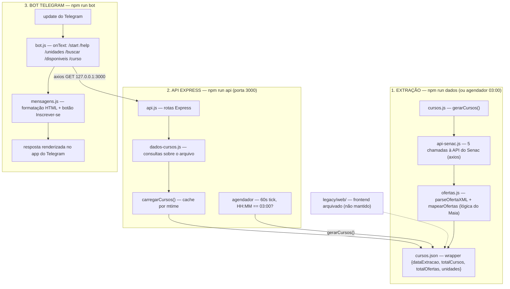

# CODIGO.md — Guia do código (2026-08-11)

> Este arquivo explica, em linguagem simples, o que cada arquivo faz e como as
> peças se encaixam. Foi criado junto com a reestruturação para o bot do
> Telegram (ver `docs/user-decisions.md` Q13–Q19). Leia junto com
> `docs/fluxo-bot.drawio` (diagrama editável) e o fluxograma abaixo.

## Visão geral: o programa tem 3 processos

| # | Processo | Comando | O que faz |
|---|----------|---------|-----------|
| 1 | **Extração** | `npm run dados` | Pergunta à API do Senac quais cursos/ofertas existem e grava em `cursos.json` |
| 2 | **API Express** | `npm run api` | Serve os dados de `cursos.json` por HTTP (localhost:3000) e, diariamente às 03:00, roda a extração de novo |
| 3 | **Bot Telegram** | `npm run bot` | Escuta mensagens no Telegram e responde consultando a API (processo 2) |

Os processos 2 e 3 rodam **separados**: o bot conversa com a API por HTTP
(`axios`), nunca lê `cursos.json` diretamente. Se a API cair, o bot avisa
"API fora do ar".

## Fluxograma do programa



Fluxo de uma busca: `/buscar excel` → `bot.js` chama
`GET /cursos?q=excel&limite=5` → `api.js` chama `dados-cursos.buscarCursos()`
→ lê o `cursos.json` (via cache) → devolve JSON → `mensagens.js` formata
HTML → Telegram mostra top 5 com link "Ver curso".

---

## Arquivos criados nesta reestruturação

### `scripts/ofertas.js` — NOVO (lógica pendente do Maia)

Transforma o **XML cru de uma oferta** (vem dentro do campo `content` da API
do Senac) no formato de 15 campos que o resto do programa usa.

- `parseOfertaXML(xmlString)` → objeto `{ nomeCampo: valor }`. O XML usa nós
  `<dynamic-element name="...">` com conteúdo em CDATA, `<option>` ou texto
  puro — a função precisa lidar com os 3 casos (referência pronta em
  `legacy/senac-api.js:56-98`).
- `mapearOfertas(ofertasApi)` → `ofertasApi.map(mapearOferta)`.
- `mapearOferta(detalhes)` → objeto com os 15 campos do contrato
  (`dataInicio`, `dataFim`, `horarios`, `diasDaSemana`, `periodoDia`,
  `totalVagas`, `vagasPSG`, `dataAberturaBolsa`, `precoVenda`,
  `precoDesconto`, `maxParcelas`, `valorParcela`, `permiteListaEspera`,
  `dataLimiteMatricula`, `localEspacoExterno`), todos string com `|| ''`.

### `scripts/dados-cursos.js` — NOVO (lógica pendente do Maia)

Camada de **consulta sobre o `cursos.json`** — é o que a API usa para
responder. Nada de HTTP aqui, só leitura de arquivo.

- `carregarCursos()` — lê o wrapper inteiro com **cache por mtime**: guarda o
  arquivo em memória e só relê quando o arquivo mudar (o agendador o
  reescreve às 03:00). Se o arquivo não existir, lança erro (a API responde
  503 pedindo `npm run dados`).
- `listarUnidades()` — unidades de `config.json` (`[{friendlyUrl, nome}]`).
- `buscarCursos(termo, limite)` — top N por termo, sem diferenciar maiúsculas,
  procurando em `curso`, `tema`, `unidade` e `tags`. Ordem alfabética.
- `cursoPorCodigoFT(codigoFT)` — procura o curso em **todas** as unidades e
  **mescla**: concatena as ofertas, junta os nomes de unidades, usa a 1ª URL.
  `null` se não achar.
- `cursosDisponiveis(limite)` — cursos com alguma oferta cuja
  `dataAberturaBolsa <= hoje` (regra BUS-03 vinda do frontend arquivado),
  ordenados pela data de abertura mais recente.

### `scripts/api.js` — REESCRITO (infra, feito pela IA)

Servidor **Express** que expõe `cursos.json` como API JSON:

- `GET /` — lista de endpoints (auto-descrição).
- `GET /cursos` — wrapper completo; com `?q=<termo>&limite=<n>` faz busca;
  com `?disponiveis=1` lista os disponíveis (os dois são mutuamente
  exclusivos).
- `GET /cursos/:codigoFT` — detalhe mesclado entre unidades (404 se não
  existir).
- `GET /unidades` — lista de unidades.
- Erros sempre em JSON `{erro: "mensagem"}`: 400 (limite inválido), 404
  (rota/curso), 503 (arquivo ausente), 500 (erro interno).

**Agendador** (mesmo processo): a cada 60 s compara `HH:MM` local com
`config.agendador.hora`; se bater, chama `gerarCursos()` (extração completa).
Guarda `extraindoEmAndamento` para não rodar duas extrações ao mesmo tempo.
A lógica de comparação é a função pura `chegouHoraAgendada(agora, horaConfig)`
(exportada — testável sem esperar a hora).

### `bot/bot.js` — NOVO (infra, feito pela IA)

**Entry point do bot.** Wiring puro, sem lógica de negócio:

1. Lê `TELEGRAM_TOKEN` do ambiente (`.env`); se faltar, imprime instrução e
   sai (exit 1).
2. Cria `TelegramBot(token, { polling: true })` — o polling fica escutando as
   mensagens do Telegram.
3. Cada `bot.onText(regex, handler)` captura um comando e, quando precisa de
   dados, chama `consultarApi(caminho)` (axios GET em `127.0.0.1:porta`).
   - `/start`, `/help` → texto fixo de ajuda.
   - `/unidades` → `GET /unidades` → `formatarListaUnidades`.
   - `/buscar <termo>` → `GET /cursos?q=...&limite=5` → `formatarListaCursos`
     (ou "Nenhum curso encontrado para ...").
   - `/disponiveis` → `GET /cursos?disponiveis=1` → `formatarListaCursos`.
   - `/curso <codigoFT>` → `GET /cursos/<codigoFT>` → `formatarDetalheCurso`
     + `botaoInscricao` (botão "Inscrever-se" quando a inscrição está aberta).
   - Fallback (`bot.on('message')`): comando desconhecido → "Envie /help".
     Ignora mensagens sem texto e comandos já tratados (evita resposta dupla).
4. Respostas sempre com `parse_mode: 'HTML'` — o Telegram renderiza `<b>`,
   `<a href>` etc. no próprio app.

### `bot/mensagens.js` — NOVO (lógica pendente do Maia)

Toda a **formatação de texto** do bot. Funções puras (entrada → saída):

- `escaparHtml(texto)` — troca `& < > " '` por entidades, obrigatório antes de
  injetar qualquer dado do Senac em texto HTML (segurança + renderização).
- `formatarData(iso)` — `"2026-08-22"` → `"22/08/2026"`.
- `formatarPreco(valor)` — `"2581"` → `R$ 2.581,00`; `"2374.52"` → `R$ 2.374,52`
  (usa `Intl.NumberFormat('pt-BR', ...)`).
- `formatarListaUnidades(unidades)` — uma linha por unidade.
- `formatarListaCursos(cursos, limite)` — cada item: nome em negrito, unidade
  e tema, link "Ver curso", sugestão "Detalhes: /curso <codigoFT>", rodapé.
- `formatarDetalheCurso(curso)` — cabeçalho + ofertas numeradas (datas,
  horários, vagas, preço, inscrições) ou "Turmas indisponíveis no momento."
- `botaoInscricao(curso, hoje)` — monta `reply_markup` com botão inline
  "Inscrever-se" (URL do curso) se alguma oferta tem `dataAberturaBolsa <=
  hoje`; senão `null` (sem botão).

## Arquivos modificados (e o que mudou)

### `scripts/api-senac.js` — cliente HTTP do Senac (fixado)

Módulo de **dados**: axios configurado para a API Liferay do Senac + IDs
fixos + funções de acesso. O que foi corrigido:

- `buscarOfertasCurso(...)` **não tinha `return`** (bug) e **não era
  exportada** — agora retorna `(data || []).map(oferta => ({...oferta,
  detalhes: parseOfertaXML(oferta.content || '')}))` e está no
  `module.exports`.
- Adicionado `paramsSerializer: { indexes: null }` no request de ofertas: a
  API do Senac **não aceita** `categoryIds[]=x` (com colchetes, padrão do
  axios) — sem isso ela devolve `{}` em vez de array e o extrator quebrava
  com "map is not a function". O endpoint de cursos (`cursos.js`) já usava
  essa serialização.
- Importa `parseOfertaXML` de `./ofertas`.

### `scripts/cursos.js` — orquestrador da extração (fixado)

- **Imports corrigidos**: agora importa `buscarOfertasCurso` (de
  `api-senac`) e `mapearOfertas` (de `ofertas`) — antes eram funções-fantasma
  (ReferenceError).
- **Saída em wrapper** (antes escrevia array plano, incompatível com o que o
  frontend/bot leem):
  ```json
  { "dataExtracao": "...", "totalCursos": N, "totalOfertas": N,
    "unidades": [{ "nome": "...", "friendlyUrl": "...", "totalCursos": N, "totalOfertas": N, "cursos": [...] }] }
  ```
- Nova função exportada **`gerarCursos(falhas = [])`** → `{totalCursos,
  totalOfertas, falhas}`: roda o pipeline, agrupa por unidade, monta o
  wrapper e grava com **escrita atômica** (`cursos.json.tmp` + `rename`) —
  nunca deixa o arquivo pela metade. **Não sobrescreve** se zero cursos forem
  extraídos (mantém o arquivo bom anterior).
- A CLI (`npm run dados`) continua igual: `--dry-run` não grava; exit code 1
  se houver falhas.
- `module.exports = { gerarCursos, extrairTodosOsCursos }` — o agendador da
  API usa `gerarCursos`.

### `config.json` — novas seções

```json
"servidor": { "porta": 3000 },     // onde a API escuta
"bot":     { "maxResultados": 5 }, // top N do /buscar e /disponiveis
"agendador": { "hora": "03:00" }   // extração automática (hora local)
```

### `.env` / `.env.example` — novos

`.env.example` (commitado) contém `TELEGRAM_TOKEN=coloque-aqui-o-token-do-BotFather`.
Copie para `.env` e preencha com o token real do @BotFather. **`.env` está no
`.gitignore`** — o token nunca vai para o git.

### `package.json` — scripts

```json
"dados":     "node scripts/cursos.js",          // extração real (era o legado)
"dados:dev": "node scripts/cursos.js --dry-run",
"api":       "node scripts/api.js",
"bot":       "node --env-file=.env bot/bot.js"  // Node 22 lê o .env nativo
```

Dependências: `node-telegram-bot-api` adicionada; `typescript` removida
(tsconfig órfão apagado).

### `legacy/web/` — frontend arquivado

`index.html`, `css/styles.css`, `scripts/script.js` movidos para
`legacy/web/` (git mv). Não é mantido, mas **as regras dele continuam
valendo como fonte das regras do bot** (formatação de data/horário, filtro
"disponível" = `dataAberturaBolsa <= hoje`, botão de inscrição).

### `scripts/todo.js` — contratos pendentes (gitignored)

Central de contratos `TODO(MAIA): TICKET-ID` (Entrada/Saída/Testes mentais).
Funções novas só nascem aqui antes de virar código.

---

## O que falta implementar (você, Maia)

Todas as funções marcadas `TODO(MAIA)` — a IA fez o wiring (imports, chamadas,
rotas), você escreve os corpos seguindo os contratos:

| Arquivo | Funções | Ticket |
|---------|---------|--------|
| `scripts/ofertas.js` | `parseOfertaXML`, `mapearOfertas`, `mapearOferta` | DADOS-01 |
| `scripts/dados-cursos.js` | `carregarCursos`, `listarUnidades`, `buscarCursos`, `cursoPorCodigoFT`, `cursosDisponiveis` | API-01 |
| `bot/mensagens.js` | `escaparHtml`, `formatarData`, `formatarPreco`, `formatarListaUnidades`, `formatarListaCursos`, `formatarDetalheCurso`, `botaoInscricao` | BOT-02/03 |

Dica: `parseOfertaXML` tem implementação de referência funcional em
`legacy/senac-api.js:56-98`; as regras de formatação estão no web arquivado
(`legacy/web/scripts/script.js`). Depois de implementar, rode a verificação da
seção "Verificação" do plano (`local://reestruturacao-chatbot-plan.md`) e o
teste ponta a ponta no Telegram.
